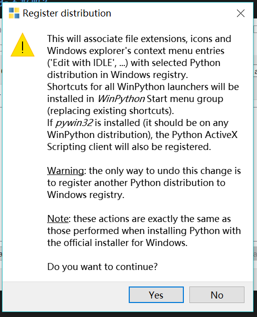

# Python不完全指南
配置过程不复杂请耐心读完并按照指示进行安装

## Q：为什么要选择WinPython安装？Anaconda不好吗？
### A:
其实Anaconda的跨平台支持比较好，Mac，Linux，Windows上都有它活跃的身影，有不少的使用Python进行科学计算乃至机器学习和AI开发的人都喜欢用Anaconda。所以下载链接给你一个，后面的安装配置使用你要 **自己完成** 了。 
[下载链接](https://mirrors.tuna.tsinghua.edu.cn/anaconda/archive/Anaconda3-5.3.0-Windows-x86_64.exe) 
这个链接是清华的镜像，很快的。~~中山没有这种镜像站~~

## Q：那Winpython要怎么安装呢？
### A：
首先你要下载WinPython，[原版下载链接](https://nchc.dl.sourceforge.net/project/winpython/WinPython_3.6/3.6.7.0/WinPython64-3.6.7.0Qt5.exe)[校园网高速镜像](http://172.19.31.119:8000/WinPython64-3.6.7.0Qt5.exe) 
下载完执行安装，当然有一点要注意，为了后续出现问题时更快解决，请阅读这份教程的朋友在设置安装路径时，**务必**按照下图进行。 

安装完之后请在安装目录 **C:\winpython** 文件夹中找到 **WinPython Control Panel** 程序并运行。界面如下图所示。 

找到上方的 **Advanced** 菜单并点击 **Register Distribution** 在弹出的窗口中点击 **Yes**

到此安装过程就告一段落了。

## Q：我拿什么写Python代码呢？
### A：
这取决于你的个人习惯。安装目录里面有很多个选择。 

原生的 **IDLE** 确实是一种选择，至于更原始的 **WinPython Command Prompt** ，我表示不建议。 
**IPython** 和 **WinPython Interpreter** 我个人比较推荐的。前者有好看的图形界面，后者有完善的代码提示自动补全能力，这个会带来极大的方便。
**Jupyter Notebook** 其实是一个不错的选择，现在很多做数据科学的都用这个，因为不仅代码的编写调试比较方便，而且notebook的形式还可以插入更多的附加内容（图表、公式）而不单单是代码里的注释。不过这次的作业还是杀鸡不要牛刀罢了。 

## Q：Python怎么学？这些库怎么用？
### A：
你是个成熟的中大人了，要学会自己读教程。 ~~不要抱怨为什么几乎全是是英文的。~~ 
顺便推荐一下Matplotlib，一个画图用的库，可以画函数图，统计图等等。 
[Python官方教程](https://docs.python.org/3.6/tutorial/) 
[Stanford课程笔记中有关Python和Numpy的简单入门](https://cs231n.github.io/python-numpy-tutorial/) 
[上述的中文翻译](https://zhuanlan.zhihu.com/p/20878530) 
[Numpy官方快速入门教程](https://docs.scipy.org/doc/numpy-1.14.5/user/quickstart.html) 
[Sympy官方教程](https://docs.sympy.org/latest/tutorial/index.html) 
[Sympy官方示例](https://github.com/sympy/sympy/wiki/Quick-examples) 
[Matplotlib官方入门教程](https://matplotlib.org/3.0.2/tutorials/introductory/pyplot.html) 
[用Python做科学计算，比较老了](http://bigsec.net/b52/scipydoc/) 

## Q：VSCode可以用来写Python吗？~~其实大多数人看了也用不上~~
### A：
**当然可以！**  
首先你需要安装插件，打开VSCode后，如下图所示在界面的 **左侧** 找到这个箭头所指的按钮，然后在图右侧显示的 **文本框** 内输入 **python**，安装搜索出的 **第一个** 插件。（点击那个插件的 **Install按钮** ） 
安装完之后请新建一个目录并如下图所示使用File菜单中的Open Folder命令 **打开这个目录** 作为存放你的Python文件的目录，比如说E:\Python。 

在这个目录里面新建一个.py的文件，然后在界面的左下角会有一个这样的按钮。 

~~当然我自己已经配置好了~~ 你们的可能不长这个样子但是位置是一样的。 点击这个按钮之后，在如下图所示这个界面里面点击弹出来的这个版本。

之后你写好了你的Python程序之后，就可以直接右键，然后选择 **在终端中运行Python文件** ，就可以运行了。

