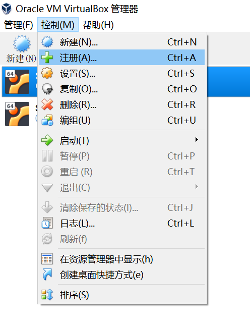

## Markdown语法手册

[Github官方手册英文版](https://guides.github.com/features/mastering-markdown/) 
[CmdMarkdown编辑器简明语法手册中文版](https://www.zybuluo.com/mdeditor?url=https%3A%2F%2Fwww.zybuluo.com%2Fstatic%2Feditor%2Fmd-help.markdown) 
[前者在Github里的版本](https://github.com/gnipbao/markdown-handbook) 
[公式输入语法手册完全版](https://www.zybuluo.com/codeep/note/163962) 

以上都是一些比较规范的语法手册，但是GitHub的markdown解析有几个槽点：

1. 标题的#要和标题内容之间有一个空格。
2. 分点描述的数字序号比如这行前面的2. 要和内容之间有一个空格。
3. 表格的前后要有一个空行。
4. （其实是语法规范）只按回车换行的话，实际显示中会和下一行连在一起显示，所以需要显示出换行的话，请在这行最后先打两个空格再按回车；或者在行末尾直接加入 标签。如果你按两次回车，也可以，那么实际显示效果就和下面一样。

5. 公式太复杂会抽风，此时建议本地预览截图上传。

## C语言编程环境

我已经搭好了虚拟机，镜像文件的下载链接如下。看到这就尽快下载，如果你点的时候一直打不开那就过段时间再来看看。。 
[速度稳定版](http://172.18.40.92:8080/SWI.7z)

[楼上不行了用这个](http://172.18.43.207/SWI.7z)

[时常抽风](http://172.18.40.92:8000/SWI.7z)

### 使用方法：

##### 1. 下载镜像文件并解压，解压后约4.5G

##### 2. 安装VirtualBox并打开

[VirtualBox下载链接](https://download.virtualbox.org/virtualbox/5.2.22/VirtualBox-5.2.22-126460-Win.exe)

安装方法直接打开安装文件，一路下一步就可以了。
**安装完之后** 请下载增强包以方便后续使用。下载完双击即可安装。

[增强包下载链接](https://download.virtualbox.org/virtualbox/5.2.22/Oracle_VM_VirtualBox_Extension_Pack-5.2.22.vbox-extpack)

##### 3.导入并启动虚拟机

如图所示找到 **注册** 按钮并点击
 
找到镜像文件解压后的文件夹并打开，选择其中的 **SWI.vbox** 并打开
 
之后如图所示选择该虚拟机并点击 **启动** 按钮。
 
启动成功后，虚拟机内系统桌面上 **另有一份使用须知** 。

## 有关Git的相关建议

基本原则：现在的方法没问题，就 **保持现状** 。 
无论是在网页上写还是VSCode写再Push，都可以，没出现问题就不需要大费周章去换。

### VSCode无法推送的有关建议

万一本地VSCode出现了问题，无法推送，有一个简单的操作步骤。

##### 1. 先备份好当前的作业文件夹（复制到另外一个你知道的文件夹）

##### 2. 删掉原有的作业文件夹，并新建一个同名的空文件夹

##### 3. 用VSCode打开这个文件夹

##### 4. 打开终端

打开方法：菜单栏“ **终端** ”点击后找到“ **新的终端** ”或使用快捷键 **Ctrl+Shift+`(Tab上方)**

##### 5. 输入如下命令

git init 
git add remote origin 你的仓库地址 
git pull 
git checkout gh-pages 

你的仓库地址：打开仓库页面，找到如下图所示的绿色按钮，点击后再点击红圈标出的按钮将实际的仓库地址复制到剪贴板，然后粘贴替换上文中“你的仓库地址” 

##### 6. 执行完之后VSCode应该可以正常工作，然后请对照之前做好的备份还原你的工作。

##### 7. 本地按对勾按钮提交更改的时候，请在输入提交信息的框随便输入一些内容之后再按回车。