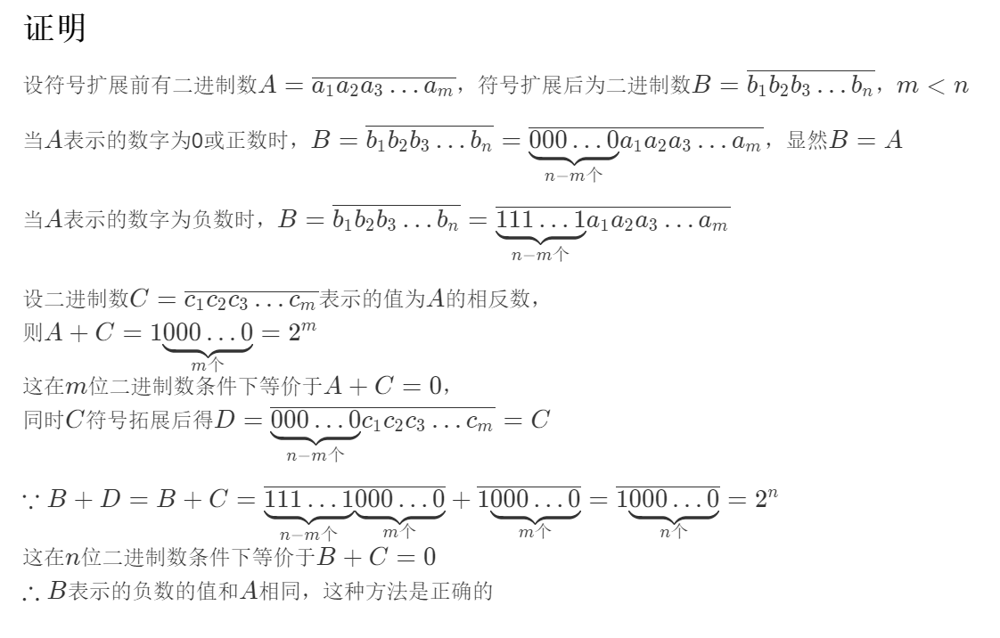

## Binary Calculation
1. x = 01000011 2 y = 11111001 2 z = 10110110 2
2. x = 11010011 2 发生溢出
3. x = 11010011 2
4. x = 01111111 2 y = 11111001 2 z =  01111010 2 发生溢出
5. x = 00111111100100000000000000000000 float
6. x = 01000001101110000000000000000000 float
7. x = 00111110111001100110011001100110 float 存在精度误差

## 名词解释
### 1. Method of complements
In mathematics and computing, the method of complements is a technique used to subtract one number from another using only addition of positive numbers. 
在数学和数值计算中，补码是一种仅通过额外的正数的用来实现从一个数中减去一个数的技巧。

### 2. Byte
The byte is a unit of digital information that most commonly consists of eight bits, representing a binary number. 
字节是一种最通常包含八个二进制位，表示一个二进制数的数字信息单元。

### 3. Integer
In computer science, an integer is a datum of integral data type, a data type that represents some range of mathematical integers. 
在计算机科学中，一个整数是整数数据类型的数据，一种表示特定范围内的数学整数的数据类型。

### 4. Floating point
In computing, floating-point arithmetic (FP) is arithmetic using formulaic representation of real numbers as an approximation so as to support a trade-off between range and precision. 
在数值计算中，浮点数计算是一种运用对实数的公式化表示作为近似以实现在范围和精度之间的平衡的计算。

## 补码相关

### 证明
设二进制数$A = \overline{a_1 a_2 a_3 \dots a_n}$，二进制数$B$为$A$的二进制负数，$A$按位取反得$C = \overline{c_1 c_2 c_3 \dots c_n}$

$\because a_1 + c_1 = a_2 + c_2 = \dots = a_n + c_n = 1$

$\therefore A + C = \underbrace{111 \dots 1}_{n个} = 2^n-1$

$\because 由负数表示定义得A + B = 2^n$

$\therefore B = C + 1$

即一个二进制数的负数等于这个数按位取反再加1

x = 111100012 = 361 oct

## 符号扩展相关

### 计算方法
x = E1 16 
y = FFFFFFE1hex 
方法为向y的左侧补1至32位即可

### NaN
NaN是一个用于表示一些非法运算（0做除数，对负数开平方根）所得结果的浮点数，它的指数位全为1，尾数位不全为零
