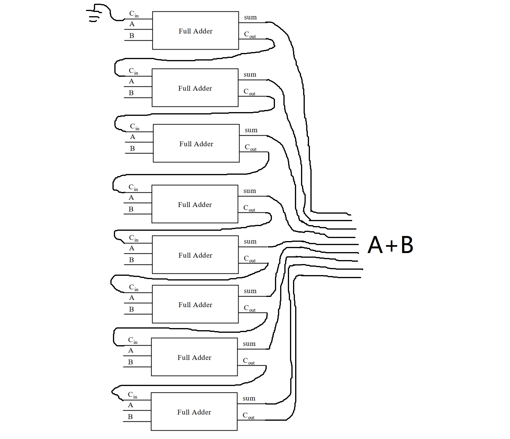

### Representation of AND and XOR Gate

#### AND Gate

The boolean expression of AND Gate is X = A·B
The Truth Table of AND Gate:

| A | B | X |
|:-:|:-:|:-:|
| 0 | 0 | 0 |
| 0 | 1 | 0 |
| 1 | 0 | 0 |
| 1 | 1 | 1 |
According to the truth table, if both input signals are 1, output signals is 1; otherwise output signals is 0.

#### XOR Gate

If the input signals are A and B then the output signal is X.
The boolean expression of AND Gate is X = A ⊕ B
The Truth Table of AND Gate:

| A | B | X |
|:-:|:-:|:-:|
| 0 | 0 | 0 |
| 0 | 1 | 1 |
| 1 | 0 | 1 |
| 1 | 1 | 0 |
According to the truth table, if both input signals are different, output signals is 1; otherwise output signals is 0.

### Circuit Digram of (A + B)(B + C)

### The Truth Table of Following Circuit

| A | B | X |
|:-:|:-:|:-:|
| 0 | 0 | 1 |
| 0 | 1 | 1 |
| 1 | 0 | 0 |
| 1 | 1 | 1 |

### The Truth Table of (AB)' = A' + B'

| A | B | A' | B' | AB | (AB)' | A' + B' |
|:-:|:-:|:--:|:--:|:--:|:-----:|:-------:|
| 0 | 0 | 1  | 1  | 0  |   1   |    1    |
| 0 | 1 | 1  | 0  | 0  |   1   |    1    |
| 1 | 0 | 0  | 1  | 0  |   1   |    1    |
| 1 | 1 | 0  | 0  | 1  |   0   |    0    |

### 8-bit Adder

### Logical Binary Operation

1. $X_8 X_7 X_6 X_5 1111$
2. $X_8' X_7' X_6' X_5' 0000$
3. $X_8 X_7 X_6 X_5 X_4 X_3 X_2 X_1$

### Wikipedia's Definition

#### Logic Gate

In electronics, a logic gate is an idealized or physical device implementing a Boolean function; that is, it performs a logical operation on one or more binary inputs and produces a single binary output.
在电子学中，一个逻辑门是一个执行一种布尔代数操作的概念或者物理设备，这意味着，它对一个或多个二进制输入进行一个逻辑运算并且产生一个二进制位的输出

#### Boolean Algebra

In mathematics and mathematical logic, Boolean algebra is the branch of algebra in which the values of the variables are the truth values true and false, usually denoted 1 and 0 respectively.
在数学和代数逻辑中，布尔代数是一种代数分支，其中变量的值是真值，真和假，各自通常用1和0表示。

### Flip-flop
Flip-flop 的中文翻译就是触发器。
One S-R latch stores one bit information.