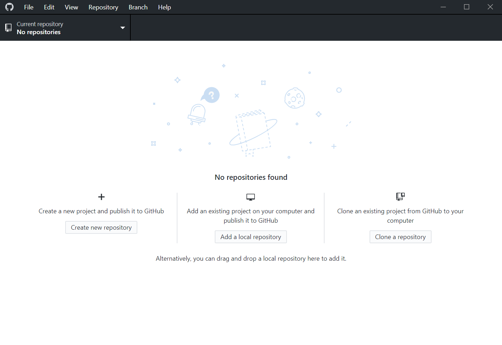
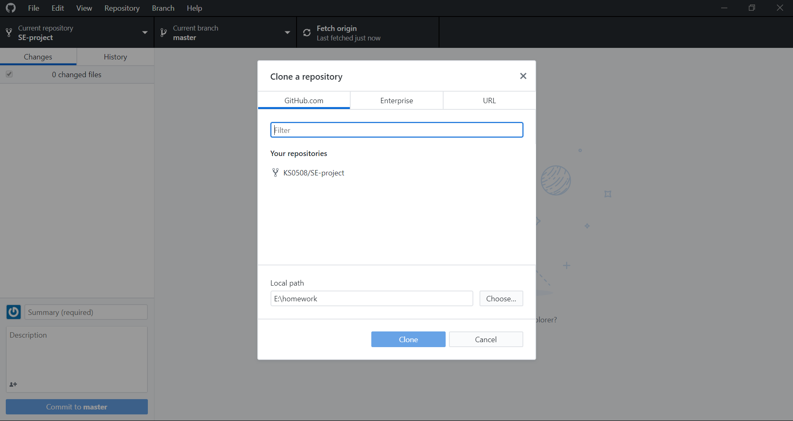
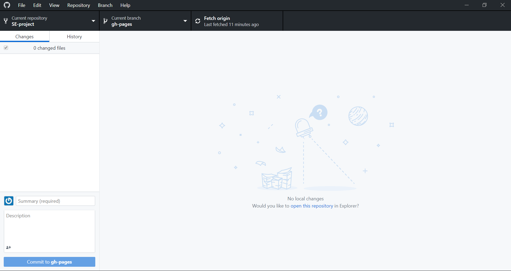
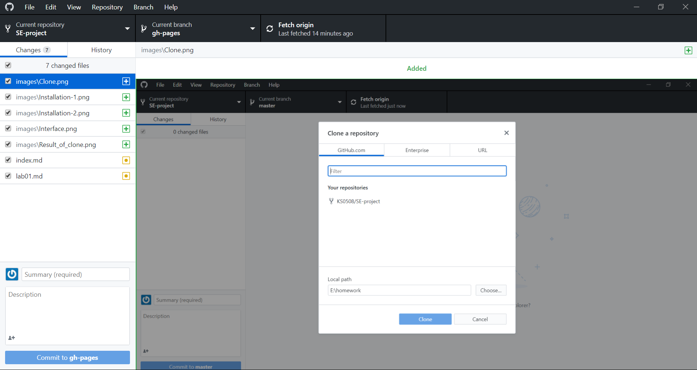

# 科学配置Git

## 邪门歪道的非官方流程

### 1、拜拜命令行

好吧我承认console是好东西，用这样的方式使用Git确实很正确。
但我不是那种勤快人啊，况且作业布置下去四天班上一半人以各种方式向我提出各种意想不到的问题，每个人都在用自己的方式去pull和push，然后，就报错了。
对报错信息一知半解的人总会干出一些意想不到的事情，然后又获得了新的错误。
所以还是用GUI吧。

### 2、GUI的选择

其实程序设计的老师给了大家一份Ubuntu的snapshot，在Linux下面工作也是不错的选择，不过大家好像还是乐于在Windows下面完成工作。
在我动手之前就有一个老哥选择了tortoiseGit，为了以示不跟风，好吧，Github for Windows，决定就是你了。

### 3、Github for Windows的安装

安装其实还真没什么，至少某种意义上非常简便，我连指定安装路径就让我login了。

### 4、开始使用

登陆之后的界面，其实还是很清爽的

How to Clone

Clone的结果

编写完自己的代码记得Commit

那么大个Commit在左下角我第一次居然没看见

### 5、检查push是否成功

我居然在图片地址前面插入了一个"/"，我说怎么没有图呢······