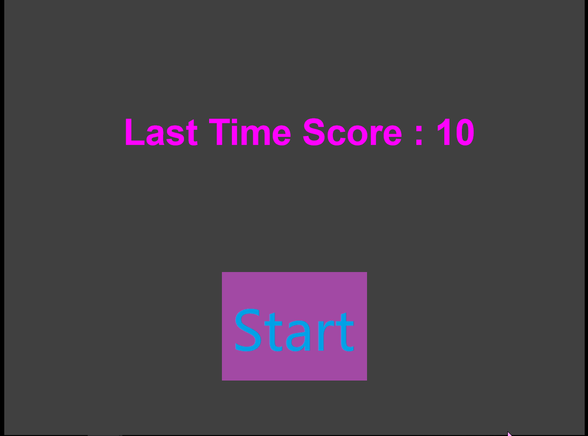

# 使用Construct2进行HTML5游戏制作

## Construct2的优势

任何游戏的核心，都是在于玩家和游戏，玩家和玩家的交互。而交互的核心，在于产生多种多样的事件和响应各式各样的事件，通过这个实现丰富多彩的互动形式。
就这个目的而言，Construct2显然是一个不错的选择，它使得整个游戏设计的过程紧紧地围绕着“对象-事件”这一模式展开，设计者可以通过简单的event sheet来有效进行游戏内事件的产生和响应，实现玩家和游戏内对象的交互，很大程度化解了反复编写调试代码的困难，从而使设计者可以把精力集中于游戏本身的模式设计和关卡展开。
下图为event sheet界面，可以看出整个事件系统的实现很简单但是也很有效，每一行都是按照的“对象-产生事件-对象-响应事件”的模式。

抛开事件系统，Construct2在游戏场景的设计上也是很方便的，每一个场景都是独立的layout，拥有自己的event sheet，event sheet也可以实现场景间的切换。在每一个场景内又分有多个类似于图层的layer，使得场景的布置可以更加立体。

从上面的event sheet可以看得出来我做的游戏有些简单，只是一个操纵直升小飞机躲开障碍的小游戏。
当然还是运用到了不少的特性，比如对象坐标的检测，是否在场景内的判定和与计分系统的联动，对象之间的碰撞检测等等

游戏演示如下
