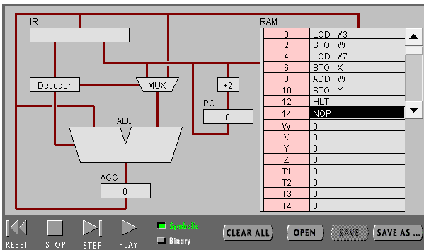
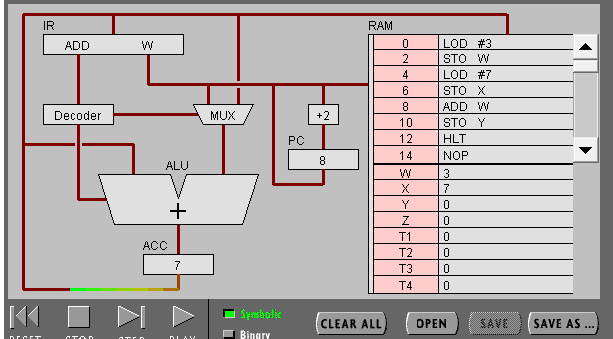
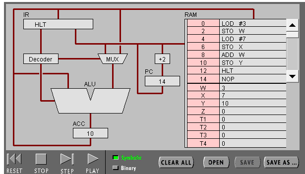
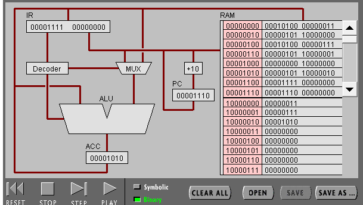
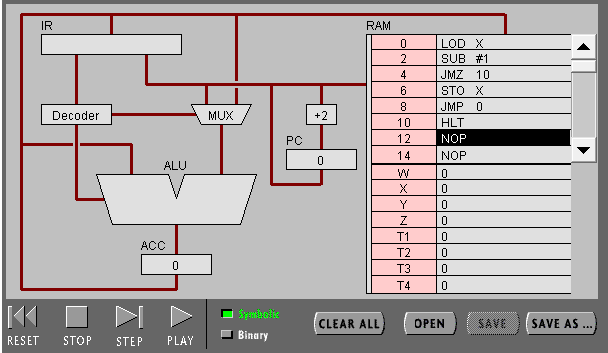
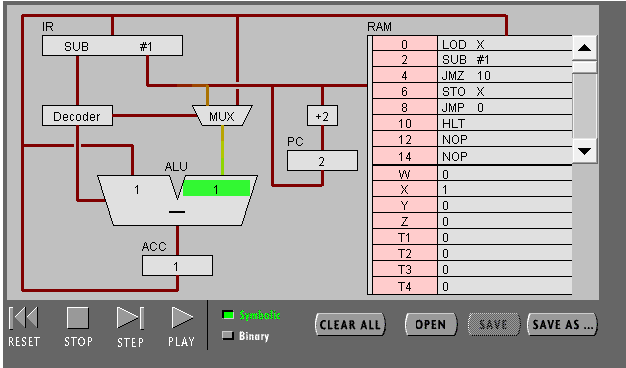
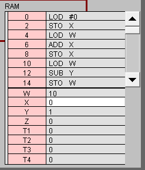
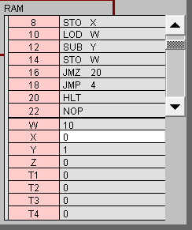
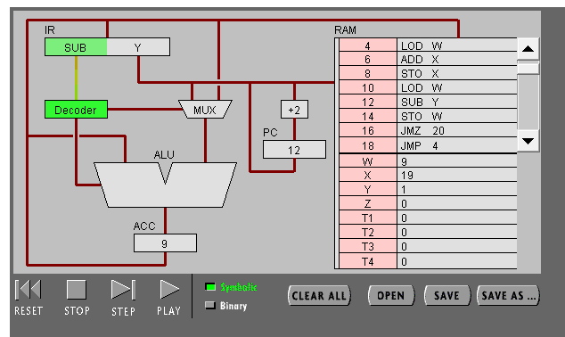
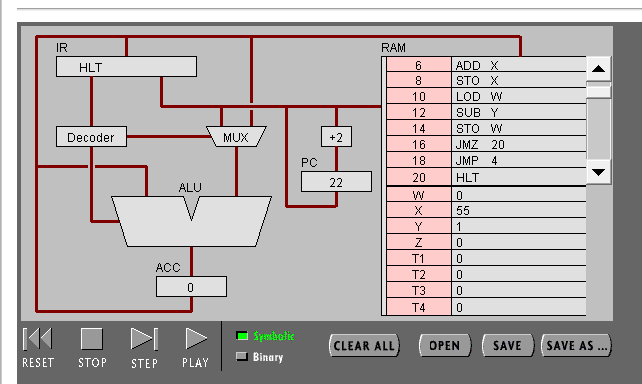

# PIPPIN实验报告
## 邵文凯 18342085

### 实验目的
1. 了解CPU内PC，IR，ACC寄存器的作用。
2. 了解各种指令的执行过程。

### 实验流程

#### 实验一
输入汇编语言程序<br>

多次点击“Step”，按步执行程序<br>

程序执行完毕<br>

点击“Binary”查看程序对应机器代码<br>


#### 实验二
输入汇编语言程序<br>

将X寄存器的值设置为1
点击“Play”执行程序<br>

程序执行完毕<br>


对该程序进行修改<br>


点击“Play”执行程序<br>

程序执行完毕<br>

X内存储的即是所求结果

### 实验小结

#### 实验一
1. PC寄存器的作用在于计数，记录CPU目前执行到了哪一个地址的指令，IR寄存器的作用在于暂存当前需要被执行的指令，并将其提供给Decoder和MUX。
2. ACC寄存器的全称是Accumulate Register，作用是存储当前一个运算的结果。
3. 从内存中获取LOD #3指令后，该指令寄存在IR中，Decoder对指令进行解码，将LOD命令传给ALU，同时命令MUX将操作数3传入ALU，然后ALU进行运算得到结果3，并存入ACC寄存器中。执行结束后，PC的计数加2，准备读取内存中的下一条指令。
4. 从内存中获取ADD W指令后，该指令寄存在IR中，Deceoder对指令进行解码，将ADD命令传给ALU，同时命令MUX将W寄存器和ACC寄存器中的值传入ALU，然后ALU执行相加操作将两个值相加，并将得到的结果存入ACC寄存器中。执行结束后，PC的计数加2，准备读取内存中的下一条指令。
5. ADD W在Decode之后需要从W寄存器和ACC寄存器中读取数据到ALU中。
6. 二进制形式00010100 00000111<br>
最开始的0001表示后面的00000111表示的是一个值而不是内存地址，0100表示的是LOD命令，00000111表示的是操作数，一个为7的值。
7. RAM的地址最开头是1，之后的七位二进制数表示内存中的某一个位置。
8. 该CPU是32位的。
9. 对应的C语言代码。
```C
int_32 a = 3;
int_32 b = 7;
int_32 c = a + b;
```

#### 实验二
1. 不断将X寄存器中的值减一，直到剪至零为止。
2. 对应C语言代码
```C
while (x != 0)
    x--;
```
3. 修改后的程序C语言计算过程
```C
int y = 0;
int w = 10;
while (w != 10)
{
    y += w;
    w--;
}
```
4. 机器语言计算过程
从W寄存器读取初始值10，从X寄存器中读取初始值0，将两者相加，结果存入X寄存器，再将W中的值减一重新存入W，再从W寄存器读取值，从X寄存器中读取值，将两者相加，结果存入X寄存器，再将W中的值减一重新存入W。如此重复知道W中的值减为0。
5. 机器语言和高级语言联系在于两者可以完成相同的功能，但是区别在于首先机器语言可以直接的对内存寄存器的部件进行操作，高级语言避免了这种直接的操作，也因此获得了更大的可移植性，不会拘泥于某一种特定机器的代码，其次高级语言的一个语句实现的功能可能需要用多个机器语言的指令才能实现。


