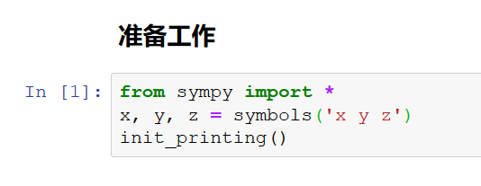
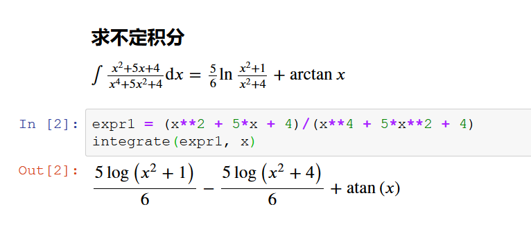
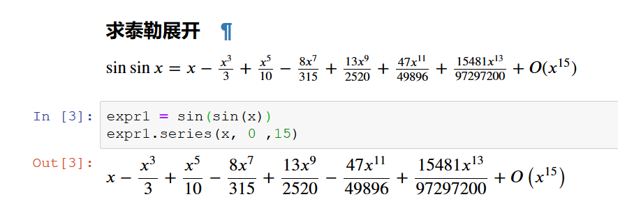
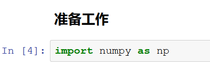
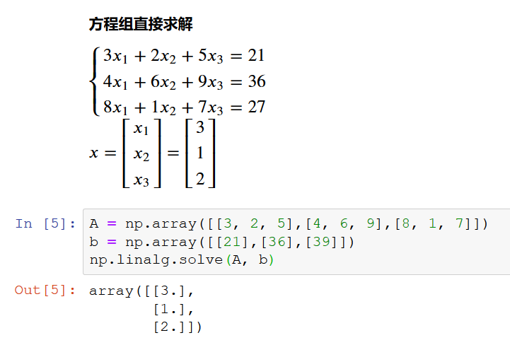
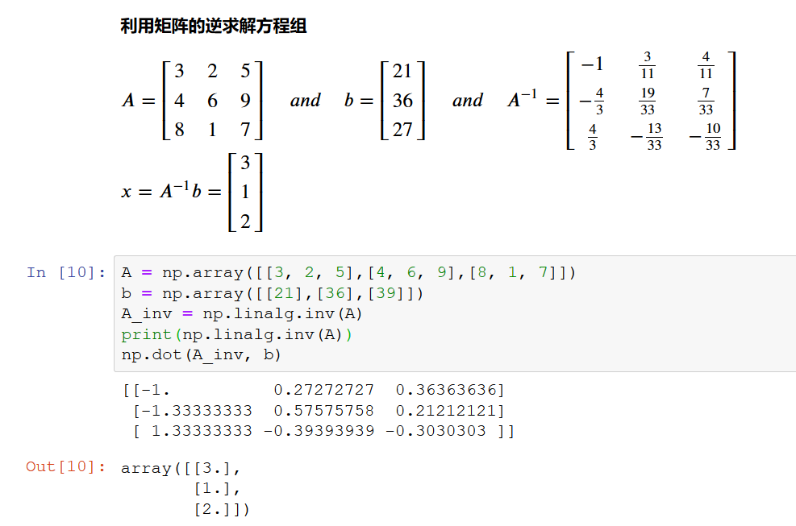

## Python 科学计算实验报告
#####  邵文凯 18342085

### 实验目的

1. 了解Python的基本指令和操作。
2. 了解如何使用工具库Numpy和Sympy进行科学计算。

### 实验流程

#### 1. 使用Sympy库进行科学计算

导入Sympy库，定义常用数学符号，优化输出格式

求不定积分
$$ \int {\frac{x^2+5x+4}{x^4+5x^2+4}} {\rm d}x = \frac{5}{6} \ln\frac{x^2+1}{x^2+4} + \arctan x $$

求泰勒展开
$$ \sin \sin x = x-\frac{x^3}{3}+\frac{x^5}{10}-\frac{8x^7}{315}+\frac{13x^9}{2520}+\frac{47x^{11}}{49896}+\frac{15481x^{13}}{97297200}+O(x^{15}) $$

#### 2. 使用Numpy库进行科学计算

导入Numpy库

直接求解方程组
$$
\left\{ 
\begin{array}{c}
3x_1+2x_2+5x_3=21 \\ 
4x_1+6x_2+9x_3=36 \\ 
8x_1+1x_2+7x_3=27
\end{array}
\right. 
$$ 
$$ x = \begin{bmatrix} x_1 \\ x_2 \\ x_3 \\ \end{bmatrix} = \begin{bmatrix} 3 \\ 1 \\ 2 \\ \end{bmatrix} $$

利用矩阵的逆和矩阵乘法求解方程组
$$ A = \begin{bmatrix} 3 & 2 & 5 \\ 4 & 6 & 9 \\ 8 & 1 & 7 \\ \end{bmatrix} \quad and \quad b = \begin{bmatrix} 21 \\ 36 \\ 27 \\ \end{bmatrix} \quad and \quad A^{-1} = \begin{bmatrix} -1 & \frac{3}{11} & \frac{4}{11} \\ -\frac{4}{3} & \frac{19}{33} & \frac{7}{33} \\ \frac{4}{3} & -\frac{13}{33} & -\frac{10}{33} \\ \end{bmatrix} $$  
$$ x = A^{-1}b = \begin{bmatrix} 3 \\ 1 \\ 2 \\ \end{bmatrix} $$

### 实验总结

1. 了解了Python的基本操作比如库的导入，赋值操作等。
2. 了解了如何使用Sympy进行积分运算和求泰勒级数以及如何使用Numpy解线性方程组和进行矩阵运算。