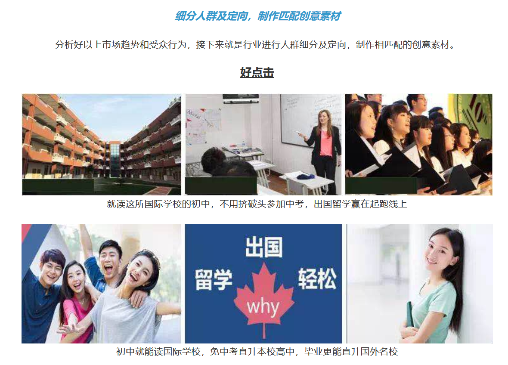

## 百度部分产品部分伦理风险行为收集

有很多家媒体在不同的时间都做过有关百度各类产品伦理风险的报道，但同样还有很多没有登上媒体报道的行为。 

[新华网有关医疗竞价广告的报道](http://www.xinhuanet.com/fortune/2018-05/09/c_1122808338.htm) 
[德邦物流假冒公司](http://www.xinhuanet.com/fortune/2018-04/22/c_1122722277.htm) 

[百度现在的广告投放产品介绍](http://yingxiao.baidu.com/topic/547/index.html) 

现在的一些广告引导示例 

